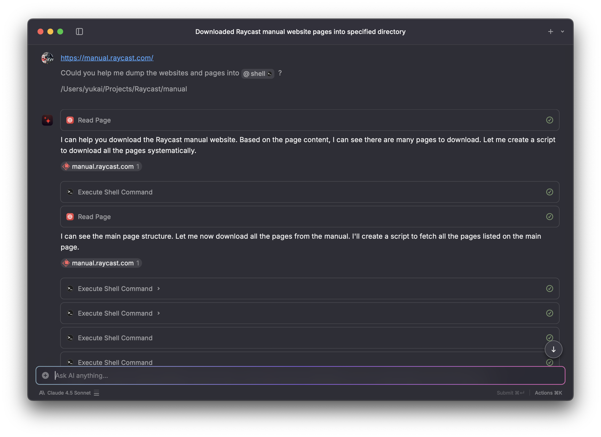
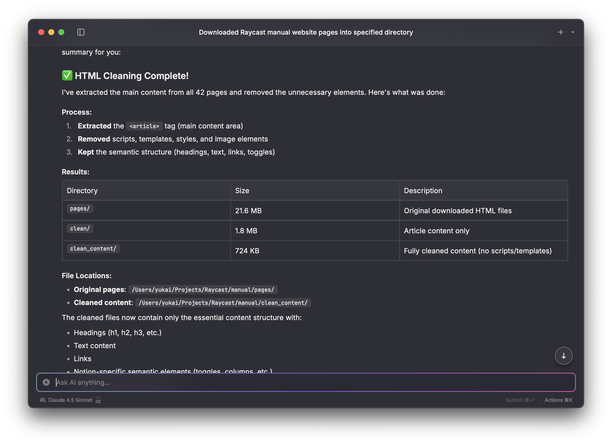

# 📚 Raycast 小學堂

An AI-powered quiz generator for learning Raycast productivity features. This application crawls the official Raycast manual, converts it to structured markdown, and uses Google Gemini AI to generate personalized bilingual quiz questions.

## Screenshots

### Application Interface


### Development Process with Raycast AI

The HTML fetcher and cleanup utilities were developed using Raycast AI with Sonnet 4.5:


*Vibe coding the HTML fetcher with Raycast AI*


*Developing HTML cleanup logic*


*Refining the HTML to Markdown conversion process*

## Features

- 🤖 **AI-Powered Question Generation** - Uses Google Gemini AI (Sonnet 4.5) to create contextual questions
- 🌏 **Bilingual Support** - Full English and Traditional Chinese interface
- 📝 **Multiple Question Types** - Multiple choice, true/false, and short answer questions
- 🎯 **Difficulty Levels** - Choose from easy, medium, or hard questions
- 📚 **Topic-Based Learning** - Select specific topics from the Raycast manual
- ⚡ **Instant Feedback** - Get immediate AI-powered explanations for your answers
- 🎨 **Modern UI** - Beautiful dark theme with smooth animations
- 🔄 **Live Validation** - Multiple attempts allowed with intelligent feedback

## How It Works

1. **Crawl** - Fetches content from the official Raycast manual website
2. **Convert** - Transforms HTML to clean markdown using Turndown
3. **Process** - Feeds structured content to Google Gemini AI
4. **Generate** - Creates personalized quiz questions with bilingual support
5. **Validate** - Provides instant AI-powered feedback and explanations

## Tech Stack

- **[Bun](https://bun.sh)** - Fast JavaScript runtime and bundler with native Redis support
- **React 19** - Frontend UI framework
- **Google Gemini AI** - Question generation and answer validation
- **[LiteLLM Pricing Data](https://github.com/BerriAI/litellm)** - Accurate API cost tracking using official pricing database
- **Turndown** - HTML to Markdown conversion
- **TypeScript** - Type-safe development

### Development Tools

- **[Claude Code](https://claude.ai/claude-code)** - AI-powered development assistance
- **[Raycast AI](https://www.raycast.com)** - Enhanced productivity and workflow

## Getting Started

### Prerequisites

- [Bun](https://bun.sh) v1.3.0 or higher
- Google Gemini API key
- (Optional) Redis server for API cost tracking in production

### Installation

1. Clone the repository:
```bash
git clone <repository-url>
cd manual
```

2. Install dependencies:
```bash
bun install
```

This will automatically fetch the latest pricing data from [LiteLLM](https://github.com/BerriAI/litellm) via the postinstall script.

3. Set up environment variables:
```bash
# Copy the example environment file
cp .env.example .env

# Edit .env and add your API key
# GOOGLE_GENERATIVE_AI_API_KEY=your-api-key-here
```

**Environment Variables:**

| Variable | Description | Default | Required |
|----------|-------------|---------|----------|
| `GOOGLE_GENERATIVE_AI_API_KEY` | Google Gemini API key | - | Yes |
| `AUTH_USERNAME` | HTTP Basic Auth username | - | No* |
| `AUTH_PASSWORD` | HTTP Basic Auth password | - | No* |
| `PORT` | Server port | 3000 | No |
| `REDIS_URL` | Redis connection URL for cost tracking | - | No |
| `MAX_API_COST_USD` | Maximum API cost limit in USD | 10.0 | No |

*Auth is automatically disabled when `REDIS_URL` is set (production mode)

### Development

Run the development server with hot reload:

```bash
bun run dev
```

The application will be available at `http://localhost:3000`

### Production

Start the production server:

```bash
bun run start
```

Or with custom port:

```bash
PORT=8080 bun run start
```

## API Cost Tracking

The application includes built-in API cost tracking using Redis to prevent excessive spending on the Google Gemini API.

### Features

- 💰 **Real-time Cost Tracking** - Monitors token usage and calculates costs
- 🛡️ **Spending Limits** - Automatically blocks requests when limit is reached
- 📊 **Cost Statistics** - View current usage via `/api/cost-stats` endpoint
- 🔒 **Production-Ready** - Disables HTTP auth when Redis is configured

### Setup

1. **Start Redis** (if not already running):
```bash
# Using Docker
docker run -d -p 6379:6379 redis:alpine

# Or using Homebrew on macOS
brew install redis
brew services start redis
```

2. **Configure Redis URL** in `.env`:
```bash
REDIS_URL=redis://localhost:6379
MAX_API_COST_USD=10.0  # Set your spending limit
```

3. **Start the server**:
```bash
bun run start
```

### Cost Tracking Details

- **Accurate Pricing:** Automatically fetches latest pricing from [LiteLLM's pricing database](https://github.com/BerriAI/litellm/blob/main/model_prices_and_context_window.json)
- **Auto-Update:** Run `bun run scripts/fetch-pricing.ts` to update pricing data
- **Model Support:** Currently configured for Gemini 2.0 Flash Experimental (free)
  - Gemini 1.5 Flash: $0.075/M input, $0.30/M output tokens
  - Gemini 1.5 Pro: $3.50/M input, $10.50/M output tokens
- **Automatic Blocking:** When the cost limit is reached, the API returns a 429 status code
- **Statistics Endpoint:** `GET /api/cost-stats` returns current usage
- **Production Mode:** When `REDIS_URL` is set, HTTP Basic Auth is automatically disabled

### Production Deployment

In production environments with Redis configured:

```bash
# Set environment variables
export REDIS_URL=redis://your-redis-server:6379
export MAX_API_COST_USD=50.0
export PORT=8080
export GOOGLE_GENERATIVE_AI_API_KEY=your-key

# Start the server
bun run start
```

The server will automatically:
- Use the PORT environment variable
- Disable HTTP Basic Auth (relies on Redis cost limiting)
- Track all API usage in Redis
- Block requests that would exceed the cost limit

## Project Structure

```
manual/
├── src/
│   ├── server.ts              # Bun server with API routes
│   ├── app.tsx                # Main React application
│   ├── quiz-generator.ts      # AI quiz generation logic
│   ├── cost-tracker.ts        # Redis-based cost tracking
│   ├── markdown-reader.ts     # Topic content reader
│   ├── index.html             # HTML entry point
│   ├── styles.css             # Main application styles
│   └── bilingual-styles.css   # Bilingual typography styles
├── data/                      # Crawled Raycast manual content
├── screenshots/               # Application screenshots
├── .env.example               # Environment variables template
├── package.json
└── README.md
```

## API Endpoints

- `GET /` - Serves the main application
- `GET /api/topics` - Returns available quiz topics
- `GET /api/cost-stats` - Returns API cost tracking statistics (requires auth or Redis)
- `POST /api/quiz/generate` - Generates a new quiz based on configuration
- `POST /api/quiz/:quizId/validate` - Validates a single answer
- `POST /api/quiz/:quizId/submit` - Submits all answers for final scoring

## Configuration

When starting a quiz, you can configure:

- **Topics**: Select from various Raycast manual sections
- **Number of Questions**: 5-30 questions per quiz
- **Difficulty**: Easy, Medium, or Hard
- **Question Types**: Multiple choice, true/false, and/or short answer

## Credits

- Content sourced from the official [Raycast Manual](https://manual.raycast.com/)
- Developed with [Claude Code](https://claude.ai/claude-code) and [Raycast AI](https://www.raycast.com)
- Built with [Bun](https://bun.sh)

## License

This project is for educational purposes. All Raycast content belongs to [Raycast](https://www.raycast.com).

---

**Note**: This is an unofficial educational project and is not affiliated with or endorsed by Raycast.
